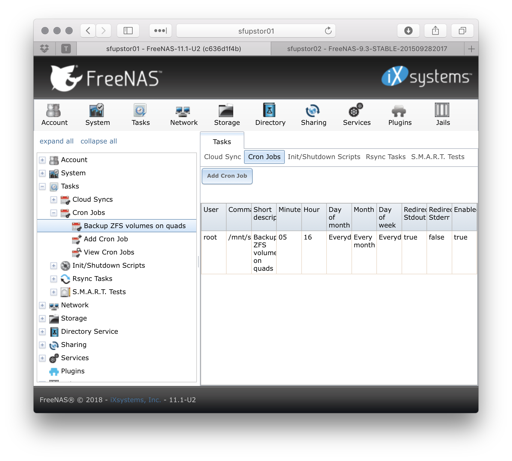
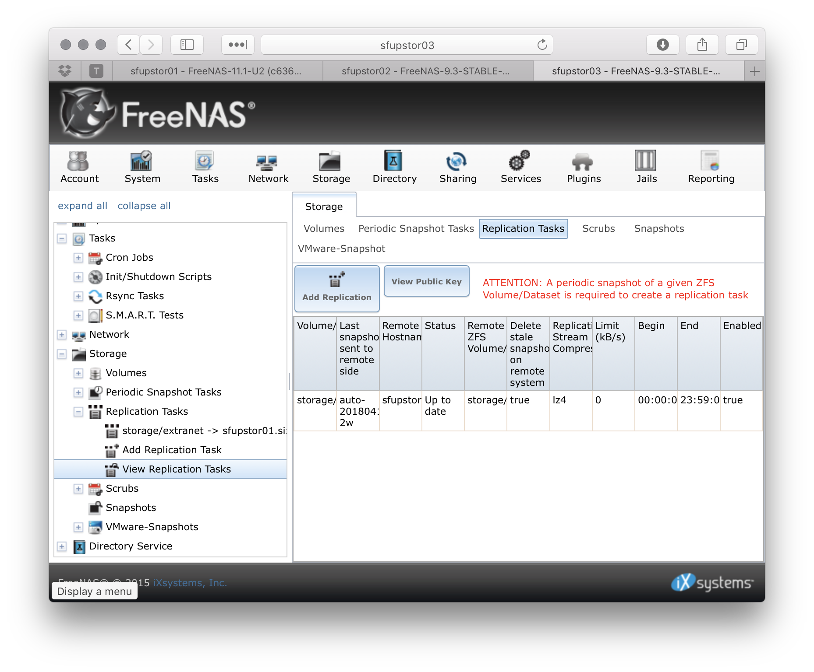

theme: Franziska, 9
footer: Replacing Traditional Backup Systems with ZFS — ZFS User Conf 2018
autoscale: true

[.hide-footer]

# Replacing Traditional Backup Systems with ZFS
## ZFS User Conf 2018
## Calvin Hendryx-Parker
### Six Feet Up

---


> Backups will be done when it is easy
-- me

---


# [fit] Backstory

AMANDA 1999-2012
Bacula 2007, 2012-2018

---


# AMANDA

## The Advanced Maryland Automatic Network Disk Archiver

Project started in the early 90s
Uses native tools (tar, dump)

^ Written in C and Perl
  BSD style and GPL license
  Currently backed and supported by Zmanda
  My First, used it at my first sysadmin job in 1999

^ Due to the native tool usage, we were able to recover, painfully, from an accidental deletion of AMANDA's index data.


---


# First Love :broken_heart: 

^ Stopped using Amanda due to the age of our current pacakges installed.
  They didn't support ZFS well at the time.
  The upgrade to AMANDA 3 was rough and did not inspire confidence due to all the moving pieces, changed uid and perms, timeouts, random hangs
  AMANDA would commonly bring down some machines that were short on disk space


---


# Bacula

* Filesystem level backup
* ~~GPLv2~~ AGPLv3 or Proprietary license

---

> However, if you are new to Unix systems or do not have offsetting experience with a sophisticated backup package, the Bacula project does not recommend using Bacula as it is much more difficult to setup and use than tar or dump.
-- The Bacula Website

---


# [fit] The Hidden Cost of Creating Open Source Code [^1]

> Bacula Systems, went farther and worked with the FSFE to create an agreement whereby Bacula Systems formally states that it will contribute all its development, not bound by a third-party proprietary agreement, to the Bacula community version within a maximum of 5 years delay.
-- Bacula Blog, December 2013


^ FSFE, Free Software Foundation Europe
  Block level available in the Enterprise version
  Enterprise version 5.1 released in 2011 included Incremental/Differential Block Level Difference Backup, but it is not in the Open Source version still to this day.

[^1]: <https://blog.bacula.org/110/>

---


# Issues

* Difficult to configure
* Many Moving Parts
* Lots of Care and Feeding
* Slow (for our use case)


^ At one point, our configs got so bad that we only had a once a week backup of some of our files
  Requires a DB backend to index the files backed up
  Lots of care and feeding to make sure it is always running smoothly
  Slow to backup, leverages a File Daemon on each box and a Storage Daemon to do the writing, Director to conduct
  Custom Python code to generate the configurations for all the various hosts to backup

---


# [fit] There has to be a
# [fit] better way

---

# [fit] What if...

---

# there was a filesystem that supported some advanced features

* snapshots
* replication
* compression
* data integrity

^ What if there were a way for all of our VMs and Jails to be backed by a filesystem or block device that supported

---

# [fit] I :heart: ZFS

---

# [fit] FreeBSD
## (or any OS that supports ZFS) just works:tm:

and we are a FreeBSD shop already!

---

# Goals

1. Reliable
1. Grainular
1. Integrity
1. Few Dependancies
1. Easy to Configure
1. Runs with little care and feeding

---

# Initial Win

```console, [.highlight: 2, 5, 8, 11]
sfup-director% wc -l bacula-dir.conf
     309 bacula-dir.conf

sfup-director% wc -l schedule/schedule.conf
     167 schedule/schedule.conf

sfup-director% wc -l clients/jobs.conf
     928 clients/jobs.conf

sfup-director% wc -l bacula-fd.conf
      27 bacula-fd.conf
```

^ Every server to be backed up will run the `bacula-fd` process
  You have to have some way to manage this process, we have written custom python scripts to templatize this

---

# Per Jail and Bhyve Host

```console
sfup-jail01% grep zfs  /etc/periodic.conf
daily_zfsnap_enable="YES"
daily_zfsnap_recursive_fs="zroot/jails"
daily_zfsnap_delete_enable="YES"
weekly_zfsnap_enable="YES"
weekly_zfsnap_recursive_fs="zroot/jails"
weekly_zfsnap_delete_enable="YES"
```

---

```console
$ sudo crontab -l -u root
# Lines below here are managed by Salt, do not edit
@daily          /usr/local/sbin/zxfer -dFkv -g 376 -T root@sfupstor01 -R zroot/jails storage/sfup-jail01
```

^ TODO: need to look up the flags on that command

---



---



---

# Photo Credits

* <https://www.flickr.com/photos/momentsnotice/12889668265>
* <https://www.flickr.com/photos/tom1231/5055926716>
* <https://www.flickr.com/photos/63259711@N04/5754479117>
* <https://www.flickr.com/photos/mio_please/2245667848>
* <https://www.baculasystems.com/architecture>
* <https://www.flickr.com/photos/mrpinkeyes/7276108196>
* <https://www.flickr.com/photos/nsub1/3537823179>
